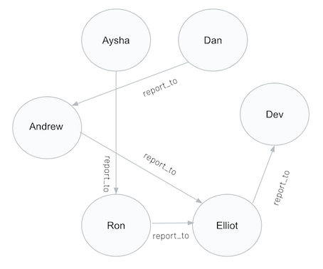
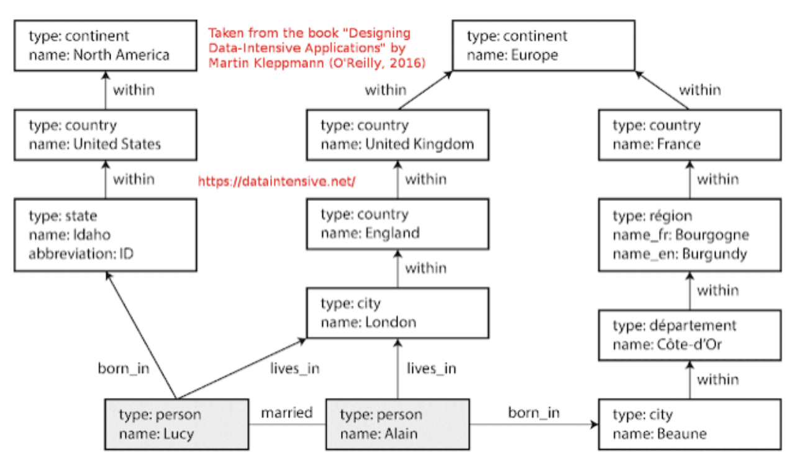

## Graph use case in MongoDB 

In this repo you'll learn how to implement a graph use case in MongoDB Atlas through 3 examples. For more information about the operator, please, visit our [documentation](https://www.mongodb.com/docs/manual/reference/operator/aggregation/graphLookup/) 

## Setup

__1. Configure Atlas Environment__
* Create an Atlas account [Atlas account](http://cloud.mongodb.com). In case you can use an existing Atlas environment you can skip this step.
* Create an __M0__ based 3 node replica-set in a single cloud provider region of your choice with default settings
* In the Security tab, add a new __IP Whitelist__ for your laptop's current IP address
* In the Atlas console, for the database cluster you deployed, click the __Connect button__, select __Connect from Compass__

__2. Download Compass__
* [Download](https://www.mongodb.com/download-center/compass) and install Compass on your laptop and paste the connection string previosly copied

<h3>Example 1: Graph traversal in a single collection</h3>

This example traverse the graph formed by all the nodes present at collection "employees". This graph is shown in the picture below



<h4> Steps To Run </h4>
  
* Create a new database called "graph"
* Create a new collection called "employees" and import the collection "graph.employees.json"
* If you are using compass, select the collection "employees", go to the tab "Aggregation", select the stage $graphloolup and paste following code:

```js
{
  from: "employees",
  startWith: "$reportsTo",
  connectFromField: "reportsTo",
  connectToField: "name",
  depthField: "depth",
  as: "reportingHierarchy",
}
```
* The operation also could be executed from MongoDB shell

```js
db.employees.aggregate( [
   {
      $graphLookup: {
         from: "employees",
         startWith: "$reportsTo",
         connectFromField: "reportsTo",
         connectToField: "name",
         as: "reportingHierarchy"
      }
   }
] )
```

<h3>Example 2: Using query filter</h3>

The following example uses a collection with a set of documents containing names of people along with arrays of their friends and their hobbies. An aggregation operation finds one particular person and traverses her network of connections to find people who list golf among their hobbies.

<h4> Steps To Run </h4>
* Create a new collection called "hobbies" and import the collection "graph.hobbies.json"
* If you are using compass, select the collection "hobbies", go to the tab "Aggregation", and create 3 stages:
  * $match
    ```js
    {
    name: "Tanya Jordan",
    }
    ```
  * $graphlookup
    ```js
    {
    from: "hobbies",
    startWith: "$friends",
    connectFromField: "friends",
    connectToField: "name",
    as: "golfers",
    depthField: "depth",
    restrictSearchWithMatch: {
    hobbies: "golf",
    },
    }
    ```
  * $project
    ```js
    {
    name: 1,
    friends: 1,
    "connections who play golf": "$golfers.name",
    }
    ```

<h3>Example 3: Graph traversal in two collections</h3>


<h4> Background </h4>

MongoDB demo to re-create the graph example cited in the book [Designing Data-Intensive Applications](https://dataintensive.net/) by _Martin Kleppmann_ (Chapter 2: 'Data Models and Query Languages', section 'Graph Like Data Models'). The book discusses an example graph data structure (hierarchy of geographical places within places, with a set of persons, each having 'born_in' and 'lives_in' attributes). The book provides examples of how this would be modelled in a graph database and in a regular relational database and then provides an example of how to query the data using a specific graph database query language (Cypher) and using SQL. The query example scenario is: __Find People Who Emigrated From US to Europe__. Specifically, this GitHub project is to demo how the same example scenario can be fulfilled using MongoDB's Document model and Aggregation pipeline.

The two main collections to be stored in MongoDB for the demo are:

* __places__  - Contains hierarchical geographical places data with the graph structure of: __SUBDIVISIONS-->COUNTRIES-->SUBREGIONS-->CONTINENTS__ (e.g. England-->United Kingdom of Great Britain and Northern Ireland-->Northern Europe-->Europe)
* __persons__ - Contains ~1 million person records where each person has 'born_in' and 'lives_in' attributes, which each reference a 'starting' place record in the places collection

Similar to the book's example, amongst the many persons records stored in MongoDB for the demo, are the following two records relating to the persons 'Lucy' and 'Alain'. This is also illustrated in the picture below:

    {fullname: 'Lucy Smith',   born_in: 'Idaho',                   lives_in: 'England'}
    {fullname: 'Alain Chirac', born_in: 'Bourgogne-Franche-Comte', lives_in: 'England'}



<h4> Steps To Run </h4>

* Create two new collection called "persons" and "places", and import the collections "graph.persons.json" (you need to unzip the file "graph.persons.json.zip previously") and "graph.places.json".
* Define index ready for use by the subsequent graphlookups. You can find an example below creating the index through mongoshell:
   ```js
    db.places.createIndex({name: 1})
   ```
* You can find below two aggreagation examples for graph traversal in two collections:

  * Aggregation 1 example: Find birth location line for Lucy Smith
    
  ```js
    db.persons.aggregate([
        {$match: {fullname: 'Lucy Smith'}},
        {$graphLookup: {
            from: 'places',
            startWith: '$born_in',
            connectFromField: 'part_of',
            connectToField: 'name',
            depthField: 'depth',
            as: 'birth_location_line'
        }}
    ]).pretty()
  ```
  * Aggreagtion 2 example: Find people who emigrated from 'United States of America'
    // (born in) to 'Europe' (lives in)
    
  ```js
    var born = 'United States of America', lives = 'Europe'
    db.persons.aggregate([
        {$graphLookup: {
            from: 'places',
            startWith: '$born_in',
            connectFromField: 'part_of',
            connectToField: 'name',
            depthField: 'depth',
            as: 'born_hierarchy'
        }},
        {$match: {'born_hierarchy.name': born}},
        {$graphLookup: {
            from: 'places',
            startWith: '$lives_in',
            connectFromField: 'part_of',
            connectToField: 'name',
            depthField: 'depth',
            as: 'lives_hierarchy'
        }},
        {$match: {'lives_hierarchy.name': lives}},
        {$project: {
            _id: 0,
            fullname: 1, 
            born_in: 1, 
            lives_in: 1, 
        }}
    ])
  ```

  * Aggregation 2 example Output:
  ```js
  { "lives_in" : "England", "fullname" : "Lucy Smith", "born_in" : "Idaho" }
  { "lives_in" : "Eastern Europe", "fullname" : "Travis Mc243", "born_in" : "West Virginia" }
  { "lives_in" : "Trenciansky kraj", "fullname" : "Simon Mc1093", "born_in" : "South Dakota" }
  { "lives_in" : "Lovrenc na Pohorju", "fullname" : "Sandy Mc1666", "born_in" : "Connecticut" }
  { "lives_in" : "Jonkopings lan", "fullname" : "Gertrude Mc1718", "born_in" : "Alaska" }
  { "lives_in" : "Sofia", "fullname" : "Bobby Mc1810", "born_in" : "California" }
  { "lives_in" : "Ilinden", "fullname" : "Simon Mc1839", "born_in" : "North Carolina" }
  { "lives_in" : "Zebbug Gozo", "fullname" : "Sandy Mc2165", "born_in" : "Texas" }
  { "lives_in" : "Planken", "fullname" : "Gertrude Mc2869", "born_in" : "United States of America" }
  { "lives_in" : "Gradsko", "fullname" : "David Mc2409", "born_in" : "Michigan" }
  .......
  .......
  ```
